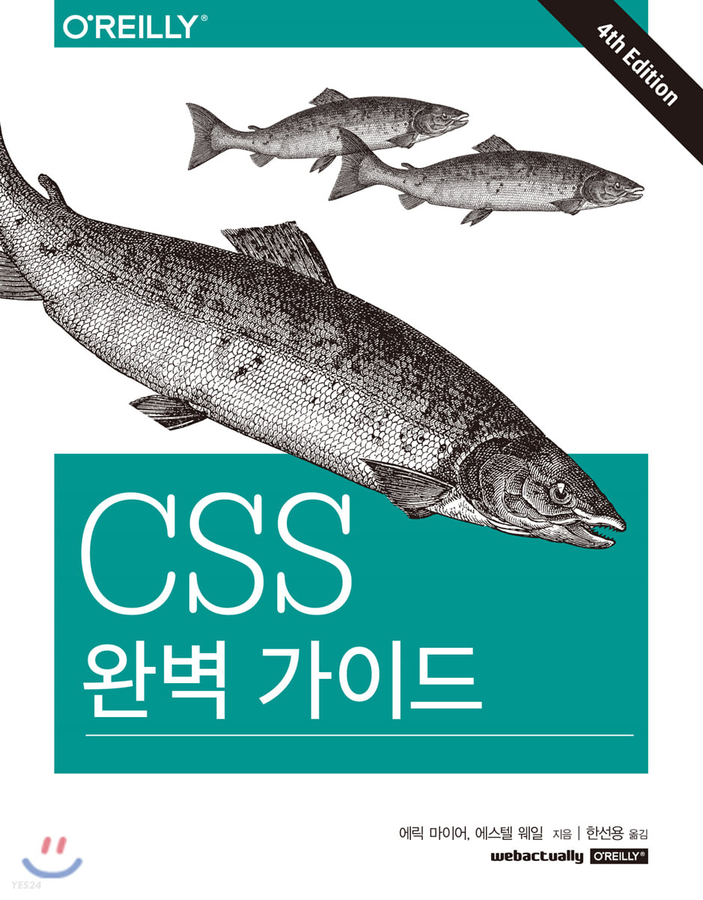

# CSS 완벽가이드

<p align="center">
    

> CSS 핵심 개념과 동작 원리를 책을 통해 이해한 후 해당 내용을 정리하기 위해 만든 기록지입니다.

</p>

---

<br>

## 1. Index

##### 01. CSS와 문서

##### 02. 선택자

##### 03. 우선순위와 캐스케이드

##### 04. 값과 단위

##### 05. 폰트

##### 06. 텍스트 프로퍼티

##### 07. 레이아웃 기본

##### 08. 패딩, 보더, 외관선, 마진

##### 09. 색깔, 배경, 그레이디언트

##### 10. 플로트와 셰이프

##### 11. 포지션

##### 12. 플렉서블 박스 레이아웃

##### 13. 그리드 레이아웃

##### 14. 테이블 레이아웃

##### 15. 리스트와 생성된 콘텐츠

##### 16. 트랜스폼

##### 17. 트랜지션

##### 18. 애니메이션

##### 19. 필터, 혼합, 자르기, 가르기

##### 20. 미디어 전용 스타일

<br>
<br>

## 2. Table (ToDo)

```
Rule 😎
00. 목차 이름을 딴 브랜치를 만들고 브랜치로 별로 push를 한다.
01. 작성자를 뺴먹지 않고 작성한다.
02. 한 페이지의 정리가 끝나면 작은 제목의 내부 링크를 연결한다.
03. 페이지 경로는 contents/인덱스.목차이름/인덱스.제목.md (한글로 입력하기)
    * ex) contents/01.CSS와문서/1.웹스타일의간략한역사.md

04. 작성 내용은 default 포맷을 참고하여 작성한다. (contents/default.md 참고)
05. 이미지 첨부시 경로는 images/인덱스.목차이름/.(png | jpeg | jpg)
    * ex) images/01.CSS와문서/main.jpeg

06. 작성이 끝난 후 README.md 파일에서 완료 여부에 체크를 한다.
```

<br>
<br>

**01장.CSS와 문서** 😜

| <center>제목</center>                           | <center>페이지</center> | <center>작성자</center> | <center>완료</center> |
| ----------------------------------------------- | :---------------------: | :---------------------: | :-------------------: |
| [웹 스타일의 간략한 역사][웹스타일의간략한역사] |           21            |     [Local][local]      |  :heavy_check_mark:   |
| [요소][요소]                                    |           23            |     [Local][local]      |  :heavy_check_mark:   |
| CSS와 HTML의 결함                               |           29            |     [Local][local]      |                       |
| 스타일시트 콘텐츠                               |           40            |     [Local][local]      |                       |
| 미디어 쿼리                                     |           46            |     [Local][local]      |                       |
| 기능 쿼리                                       |           52            |     [Local][local]      |                       |
| 요약                                            |           56            |     [Local][local]      |                       |

<br>

**02장.선택자** 😚

| <center>제목</center>                               | <center>페이지</center> | <center>작성자</center> | <center>완료</center> |
| --------------------------------------------------- | :---------------------: | :---------------------: | :-------------------: |
| [기본 스타일 규칙][기본스타일규칙]                  |           57            |    [Santos][santos]     |                       |
| [그룹화][그룹화]                                    |           63            |    [Santos][santos]     |                       |
| [클래스 선택자와 ID 선택자][클래스선택자와id선택자] |           70            |    [Santos][santos]     |                       |
| 속성 선택자                                         |           78            |    [Santos][santos]     |                       |
| 문서 구조                                           |           91            |    [Santos][santos]     |                       |
| 가상 클래스 선택자                                  |           102           |    [Santos][santos]     |                       |
| 가상 요소 선택자                                    |           140           |    [Santos][santos]     |                       |
| 요약                                                |           144           |    [Santos][santos]     |                       |

**03장.우선순위와 캐스케이드** 😋

| <center>제목</center> | <center>페이지</center> | <center>작성자</center> | <center>완료</center> |
| --------------------- | :---------------------: | :---------------------: | :-------------------: |
| 우선순위              |           145           |     [Local][local]      |                       |
| 상속                  |           153           |     [Local][local]      |                       |
| 캐스케이드            |           157           |     [Local][local]      |                       |
| 요약                  |           164           |     [Local][local]      |                       |

<br>

**04장.값과 단위** 😝

| <center>제목</center>          | <center>페이지</center> | <center>작성자</center> | <center>완료</center> |
| ------------------------------ | :---------------------: | :---------------------: | :-------------------: |
| 키워드, 문자열, 기타 텍스트 값 |           165           |    [Santos][santos]     |                       |
| 숫자와 퍼센트                  |           173           |    [Santos][santos]     |                       |
| 거리                           |           174           |    [Santos][santos]     |                       |
| 계산된 값                      |           186           |    [Santos][santos]     |                       |
| 프로퍼티 값                    |           187           |    [Santos][santos]     |                       |
| 색상                           |           188           |    [Santos][santos]     |                       |
| 각도                           |           200           |    [Santos][santos]     |                       |
| 시간과 주파수                  |           201           |    [Santos][santos]     |                       |
| 위치                           |           202           |    [Santos][santos]     |                       |
| 커스텀 값                      |           203           |    [Santos][santos]     |                       |

<br>

**05장.폰트** 🤨

| <center>제목</center> | <center>페이지</center> | <center>작성자</center> | <center>완료</center> |
| --------------------- | :---------------------: | :---------------------: | :-------------------: |
| 폰트 패밀리           |           209           |     [Local][local]      |                       |
| @font-face 사용하기   |           216           |     [Local][local]      |                       |
| 폰트 두께             |           232           |     [Local][local]      |                       |
| 폰트 크기             |           241           |     [Local][local]      |                       |
| 폰트 스타일           |           255           |     [Local][local]      |                       |
| 폰트 스트레칭         |           259           |     [Local][local]      |                       |
| 폰트 커닝             |           262           |     [Local][local]      |                       |
| 폰트 변형             |           263           |     [Local][local]      |                       |
| 폰트 기능             |           267           |     [Local][local]      |                       |
| 폰트 합성             |           271           |     [Local][local]      |                       |
| font 프로퍼티         |           272           |     [Local][local]      |                       |
| 폰트 매칭             |           278           |     [Local][local]      |                       |
| 요약                  |           280           |     [Local][local]      |                       |

<br>

**06장.텍스트 프로퍼티** 🧐

| <center>제목</center>  | <center>페이지</center> | <center>작성자</center> | <center>완료</center> |
| ---------------------- | :---------------------: | :---------------------: | :-------------------: |
| 들여쓰기와 인라인 정렬 |           283           |    [Santos][santos]     |                       |
| 인라인 정렬            |           293           |    [Santos][santos]     |                       |
| 단어 간격과 문자 간격  |           305           |    [Santos][santos]     |                       |
| 텍스트 변형            |           310           |    [Santos][santos]     |                       |
| 텍스트 장식            |           313           |    [Santos][santos]     |                       |
| 텍스트 렌더링          |           317           |    [Santos][santos]     |                       |
| 텍스트 그림자          |           319           |    [Santos][santos]     |                       |
| 공백 처리              |           320           |    [Santos][santos]     |                       |
| 줄바꿈과 하이픈        |           325           |    [Santos][santos]     |                       |
| 쓰기 모드              |           332           |    [Santos][santos]     |                       |
| 요약                   |           341           |    [Santos][santos]     |                       |

<br>

**07장.레이아웃 기본** 🤪

| <center>제목</center> | <center>페이지</center> | <center>작성자</center> | <center>완료</center> |
| --------------------- | :---------------------: | :---------------------: | :-------------------: |
| 기본 박스             |           343           |     [Local][local]      |                       |
| 요소 디스플레이 변경  |           347           |     [Local][local]      |                       |
| 인라인 요소           |           375           |     [Local][local]      |                       |
| 요약                  |           408           |     [Local][local]      |                       |

<br>

**08장.패읻, 보더, 외곽선, 마진** 🤓

| <center>제목</center> | <center>페이지</center> | <center>작성자</center> | <center>완료</center> |
| --------------------- | :---------------------: | :---------------------: | :-------------------: |
| 기본 요소 박스        |           409           |    [Santos][santos]     |                       |
| 패딩                  |           412           |    [Santos][santos]     |                       |
| 보더                  |           425           |    [Santos][santos]     |                       |
| 외곽선                |           473           |    [Santos][santos]     |                       |
| 마진                  |           480           |    [Santos][santos]     |                       |
| 오약                  |           491           |    [Santos][santos]     |                       |

<br>

**09장.색깔, 배경, 그레이디언트** 🥸

| <center>제목</center> | <center>페이지</center> | <center>작성자</center> | <center>완료</center> |
| --------------------- | :---------------------: | :---------------------: | :-------------------: |
| 색깔                  |           493           |     [Local][local]      |                       |
| 배경                  |           500           |     [Local][local]      |                       |
| 그레이디언트          |           565           |     [Local][local]      |                       |
| 박스 섀도             |           606           |     [Local][local]      |                       |
| 오약                  |           610           |     [Local][local]      |                       |

<br>

**10장.플로트와 셰이프** 😀

| <center>제목</center> | <center>페이지</center> | <center>작성자</center> | <center>완료</center> |
| --------------------- | :---------------------: | :---------------------: | :-------------------: |
| 플로트                |           611           |    [Santos][santos]     |                       |
| 클리어                |           629           |    [Santos][santos]     |                       |
| 셰이프                |           633           |    [Santos][santos]     |                       |
| 오약                  |           651           |    [Santos][santos]     |                       |

<br>

**11장.포지션** 😃

| <center>제목</center>    | <center>페이지</center> | <center>작성자</center> | <center>완료</center> |
| ------------------------ | :---------------------: | :---------------------: | :-------------------: |
| 기본 개념                |           653           |     [Local][local]      |                       |
| 오프셋 프로퍼티          |           656           |     [Local][local]      |                       |
| 너비와 높이              |           659           |     [Local][local]      |                       |
| 콘텐츠 오버플로와 자르기 |           664           |     [Local][local]      |                       |
| 요소 가시성              |           666           |     [Local][local]      |                       |
| absolute 포지션          |           667           |     [Local][local]      |                       |
| fixed 포지션             |           688           |     [Local][local]      |                       |
| relative 포지션          |           690           |     [Local][local]      |                       |
| sticky 포지션            |           693           |     [Local][local]      |                       |
| 요약                     |           697           |     [Local][local]      |                       |

<br>

**12장.플렉서블 박스 레이아웃** 😄

| <center>제목</center>       | <center>페이지</center> | <center>작성자</center> | <center>완료</center> |
| --------------------------- | :---------------------: | :---------------------: | :-------------------: |
| 플렉스박스 기초             |           699           |    [Santos][santos]     |                       |
| 플렉스 컨테이너             |           706           |    [Santos][santos]     |                       |
| 플렉스 아이템 정렬          |           725           |    [Santos][santos]     |                       |
| 플렉스 컨테이너             |           726           |    [Santos][santos]     |                       |
| 콘텐츠(가로)정렬            |           726           |    [Santos][santos]     |                       |
| 아이템 정렬                 |           735           |    [Santos][santos]     |                       |
| align-self 프로퍼티         |           742           |    [Santos][santos]     |                       |
| 콘텐츠(세로)정렬            |           744           |    [Santos][santos]     |                       |
| 플렉스 아이템               |           750           |    [Santos][santos]     |                       |
| 플렉스 아이템 전용 프로퍼티 |           755           |    [Santos][santos]     |                       |
| flex 프로퍼티               |           756           |    [Santos][santos]     |                       |
| flex-grow 프로퍼티          |           758           |    [Santos][santos]     |                       |
| flex-shrink 프로퍼티        |           765           |    [Santos][santos]     |                       |
| flex-basis 프로퍼티         |           777           |    [Santos][santos]     |                       |
| flex 단축 프로퍼티          |           789           |    [Santos][santos]     |                       |
| order 프로퍼티              |           795           |    [Santos][santos]     |                       |

<br>

**13장.그리드 레이아웃** 😆

| <center>제목</center> | <center>페이지</center> | <center>작성자</center> | <center>완료</center> |
| --------------------- | :---------------------: | :---------------------: | :-------------------: |
| 그리드 컨테이너 생성  |           803           |     [Local][local]      |                       |
| 기본 그리드 용어      |           806           |     [Local][local]      |                       |
| 그리드 라인 배치      |           809           |     [Local][local]      |                       |
| 그리드에 요소 연결    |           840           |     [Local][local]      |                       |
| 그리드 흐름           |           861           |     [Local][local]      |                       |
| 자동 그리드 라인      |           867           |     [Local][local]      |                       |
| grid 단축 프로퍼티    |           870           |     [Local][local]      |                       |
| 그리드 공간 열기      |           875           |     [Local][local]      |                       |
| 정렬과 그리드         |           883           |     [Local][local]      |                       |
| 레이어와 순서         |           890           |     [Local][local]      |                       |
| 요약                  |           892           |     [Local][local]      |                       |

<br>

**14장.테이블 레이아웃** 😅

| <center>제목</center> | <center>페이지</center> | <center>작성자</center> | <center>완료</center> |
| --------------------- | :---------------------: | :---------------------: | :-------------------: |
| 테이블 포맷           |           893           |    [Santos][santos]     |                       |
| 테이블 셀 보더        |           910           |    [Santos][santos]     |                       |
| 테이블 크기           |           920           |    [Santos][santos]     |                       |
| 요약                  |           933           |    [Santos][santos]     |                       |

<br>

**15장.리스트와 생성된 콘텐츠** 😂

| <center>제목</center> | <center>페이지</center> | <center>작성자</center> | <center>완료</center> |
| --------------------- | :---------------------: | :---------------------: | :-------------------: |
| 리스트                |           935           |     [Local][local]      |                       |
| 생성된 콘텐츠         |           950           |     [Local][local]      |                       |
| 카운터 패턴 정의      |           970           |     [Local][local]      |                       |
| 요약                  |           997           |     [Local][local]      |                       |

<br>

**16장.트랜스폼** 🤣

| <center>제목</center> | <center>페이지</center> | <center>작성자</center> | <center>완료</center> |
| --------------------- | :---------------------: | :---------------------: | :-------------------: |
| 좌표계                |           999           |    [Santos][santos]     |                       |
| 트랜스폼              |          1003           |    [Santos][santos]     |                       |
| 트랜스폼 프로퍼티     |          1023           |    [Santos][santos]     |                       |
| 요약                  |          1038           |    [Santos][santos]     |                       |

<br>

**17장.트랜지션** 🥲

| <center>제목</center>                     | <center>페이지</center> | <center>작성자</center> | <center>완료</center> |
| ----------------------------------------- | :---------------------: | :---------------------: | :-------------------: |
| CSS 트랜지션                              |          1039           |     [Local][local]      |                       |
| 트랜지션 관련 프로퍼티                    |          1041           |     [Local][local]      |                       |
| 처음 상태로 돌아가는 트랜지션             |          1069           |     [Local][local]      |                       |
| 애니메이션을 적용할 수 있는 프로퍼티와 값 |          1074           |     [Local][local]      |                       |
| 폴백:트랜지션은 필수가 아닙니다           |          1079           |     [Local][local]      |                       |
| 트랜지션 인쇄                             |          1080           |     [Local][local]      |                       |

<br>

**18장.애니메이션** 😇

| <center>제목</center>                            | <center>페이지</center> | <center>작성자</center> | <center>완료</center> |
| ------------------------------------------------ | :---------------------: | :---------------------: | :-------------------: |
| 키프레임 정의                                    |          1084           |    [Santos][santos]     |                       |
| 키프레임 애니메이션 설정                         |          1086           |    [Santos][santos]     |                       |
| 키프레임 선택자                                  |          1087           |    [Santos][santos]     |                       |
| 요소에 애니메이션 적용                           |          1094           |    [Santos][santos]     |                       |
| 하나로 모아서                                    |          1136           |    [Santos][santos]     |                       |
| 애니메이션, 선택자 우선순위, 애니메이션 우선순위 |          1141           |    [Santos][santos]     |                       |
| 발작과 전정 장애                                 |          1143           |    [Santos][santos]     |                       |
| 애니메이션 이벤트와 접두사                       |          1144           |    [Santos][santos]     |                       |
| 애니메이션 인쇄                                  |          1146           |    [Santos][santos]     |                       |

<br>

**19장.필터, 혼합, 자르기, 가리기** 😍

| <center>제목</center> | <center>페이지</center> | <center>작성자</center> | <center>완료</center> |
| --------------------- | :---------------------: | :---------------------: | :-------------------: |
| CSS필터               |          1147           |     [Local][local]      |                       |
| 합성과 혼합           |          1155           |     [Local][local]      |                       |
| 배경 혼합             |          1164           |     [Local][local]      |                       |
| 클립과 마스크         |          1169           |     [Local][local]      |                       |
| 마스크                |          1176           |     [Local][local]      |                       |
| 객체 맞춤과 위치 지정 |          1194           |     [Local][local]      |                       |

<br>

**20장.미디어 전용 스타일** 🥰

| <center>제목</center>    | <center>페이지</center> | <center>작성자</center> | <center>완료</center> |
| ------------------------ | :---------------------: | :---------------------: | :-------------------: |
| 미디어 전용 스타일 정의  |          1199           |    [Santos][santos]     |                       |
| 페이지로 구분되는 미디어 |          1212           |    [Santos][santos]     |                       |
| 요약                     |          1230           |    [Santos][santos]     |                       |

<br>
<br>

## 3. Reference

- [css완벽가이드][css완벽가이드]

[css완벽가이드]: http://www.yes24.com/Product/Goods/98858290
[santos]: https://github.com/SangchoKim
[local]: https://github.com/blocallee
[웹스타일의간략한역사]: ./contents/01.CSS와문서/1.웹스타일의간략한역사.md
[기본스타일규칙]: ./contents/02.선택자/1.기본스타일규칙.md
[그룹화]: ./contents/02.선택자/2.그룹화.md
[클래스선택자와id선택자]: ./contents/02.선택자/3.클래스선택자와ID선택자.md
[요소]: ./contents/01.CSS와문서/2.요소.md
