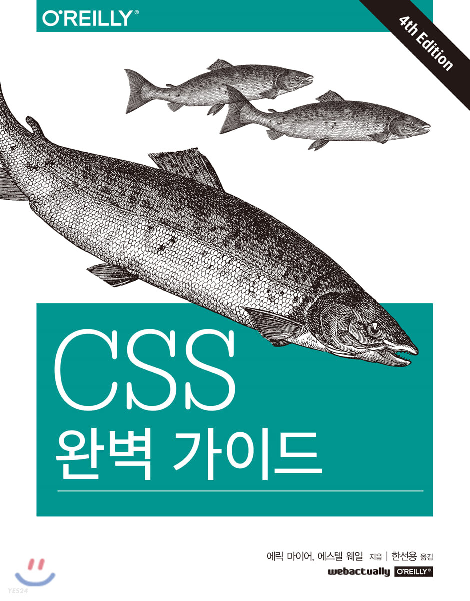

<p>

#### [back](../../../README.md) &nbsp;&nbsp; | &nbsp;&nbsp; write by [Santos](https://github.com/SangchoKim)

</p>

# 2-4. 속성 선택자

<p align="center" >
    
</p>


---
<p> * 이 글은 CSS 완벽가이드 책을 참고하여 기록하였습니다. </p>

> 속성 선택자는 속성과 그 값을 통해 요소를 선택하는 데 사용됨.

## 1. 단순 속성 선택자

> 요소에 어떤 속성이 있기만 하면 그 값에 관계없이 선택할 때 사용.

```
<단순 속성 선택자 예시 > 

<h1 class="hoopla">Hello</h1>
<h1>Serenity</h1>
<h1 class="fancy">Folling</h1>

<a href="http://www.w3.org/" title="W3C Home">W3C</a><br /> 
<a href="http://www.webstandard.org">Standards Info</a><br /> 
<a title="Not a link">dead.letter</a> 

1) 기본 단순 속성 선택자 
h1[class] {color: silver;}
img[alt] {border: 3px solid red;}
*[title] {font-weight: bold;}


2) 다중 단순 속성 선택자
a[href][title] {font-weight: bold;}

```

#### \* 예시 설명 \*

##### 1) 기본 단순 속성 선택자 

 \- class 속성이 있는 h1 오쇼를 값에 관계 없이 모두 선택해서 텍스트를 은색으로 만듬.

 \- alt 속성이 있는 모든 이미지에 스타일을 적용, 마크업 확인.

 ##### 2) 다중 단순 속성 선택자
 
 \- 속성 선택자를 체인으로 연결하여 href와 title 속성이 모두 있는 하이퍼링크의 텍스를 굵게 표시.

</br>

## 2. 속성 값이 정확할 때만 선택하기

> 선택자를 더 구체화해서 속성 값이 정확히 일치할 때만 선택.  

```
< 속성 값이 정확할 때 선택 예시 >

<a href="http://www.css-discuss.org/about.html" title="about">about</a><br /> 
<a href="http://www.w3.org/" title="W3C Home">W3C</a><br /> 
<p class="urgent warning">When handling plutonium, care must be taken to avoid the formation of a critical mass.</p>

1) 일반 속성 값이 정확할 때 선택자
a[href="http://www.css-discuss.org/about.html"] {font-weight: bold;}

2) 다중 속성 값이 정확할 때 선택자
a[href="http://www.w3.org/"][title="W3C Home"] {font-size: 200%;}

3) 다중 클래스 값이 정확할 때 선택자
p[class="urgent warning"] {font-weight: bold;}

```

#### \* 예시 설명 \*

 ##### 1) 일반 속성 값이 정확할 때 선택자

 \- 웹 서버의 특정 문서를 카리키는 하이퍼링크를 모두 굵게 표시.

 \- www. 부분이나 http를 https로 바꿔도 이 선택자는 동작하지 않음.

##### 2) 다중 속성 값이 정확할 때 선택자

 \- 속성-값 선택자를 체인으로 연결해 선택 범위를 더 구체적으로 좁힐 수 있음.

 \- href 값이 http://www.w3.org/ 이면서, title 값이 W3C Home인 하이퍼링크의 텍스트 크기를 두배로 늘림. 

 ##### 3) 다중 클래스 값이 정확할 때 선택자

 \- class 값이 정확히 urgent warning 인 단어 순서도 일치, 사이에 스페이스가 단 하나만 있는 p요소를 찾음.

 \- 일반 속성 및 다중 속성처럼 선택하기보다는 다르게 일치하는 문자열을 찾는 것에 더 가깝다고 느껴짐. 

</br>

## 3. 부분 일치 속성 값 선택자

> 속성 값 일부만 맞는 요소 전부 선택할 때 사용.

| <center>번호</center> | <center>유형</center> | <center>설명</center> |  
| :-----------------------------: | :-----------------------------: | --------------------- |
| 1 | [foo \|= "bar"] | foo 속성의 값이 bar로 시작하고 그 뒤에 하이픈이 오는 요소 or foo속성의 값이 정확히 bar인 요소를 선택.|
| 2 | [foo ~= "bar"] | foo 속성의 값이 공백으로 구분된 단어 리스트이고, 그 리스트에 bar라는 단어가 포함된 요소 선택.|
| 3 | [foo *= "bar"] | foo 속성의 값인 문자열의 일부분으로 bar가 포함된 요소를 선택.|
| 4 | [foo ^= "bar"] | foo 속성의 값이 bar로 시작하는 요소를 선택.|
| 5 | [foo $= "bar"] | foo 속성의 값이 bar로 끝나는 요소를 선택.|

 ### 1) 부분 문자열로 시작 & 일치하는 속성 값 

```
< 예시 >

<h1 lang="en">Hello</h1>
<p lang="en-us">Great</p>
<div lang="en-au">G'day</div>
<p lang="fr">Bonjour!</p>
<h4 lang="cy-en">Jrooana</h4>

1) 일반 선택자
*[lang|="en"] {color: white;}

<button class="btn-small-arrow-active">Click Me</button>

2) 클래스 선택자
*[class|="btn"] {border-radius: 5px;}

```

#### \* 예시 설명 \*

 ##### 1) 일반 선택자

 \- lang 속성 값이 정확이 en 이거나 en-으로 시작하는 요소를 선택.

 \- 위에 예시에서는 처음 세 요소는 선택, 마지막 두 요소는 선택되지 않음.

  ##### 2) 클래스 선택자

 \- btn btn-small btn-arrow btn-active 같은 중복 클래스 보다 btn-small-arrow-active 같은 클래스를 만들고 부분 문자열 선택자를 써서 요소를 선택하는 편이 좋은 선택.

 ### 2) 공백으로 구분된 리스트에서 한 단어 일치 

```
< 예시 >

<p class="urgent warning">When handling plutonium, care must be taken to avoid the formation of a critical mass.</p>

1) 일반 선택자
p[class~="warning"] {font-weight: bold;}

<button class="btn-small-arrow-active">Click Me</button>

2) 클래스 선택자
*[class|="btn"] {border-radius: 5px;}

```

#### \* 예시 설명 \*

 ##### 1) 일반 선택자

 \- 속성 값에 공백으로 구분된 단어가 있는지에 따라 선택하는 유형의 핵심이기 때문에 class에서 많이 사용.

 \- p.warning과 p[class~="warning"]의 결과는 같음.

 \- 오직 class에서만 사용되는 것은 아님. img[title~="Figure"] {border: 1px solid gray;} 규칙은 img 태그에 title 속성에 Figure라는 단어가 포함된 이미지를 모두 선택함.

### 3) 부분 문자열 선택자 * 여기서부터 작성 필요.

```
< 예시 >

<p class="urgent warning">When handling plutonium, care must be taken to avoid the formation of a critical mass.</p>

1) 일반 선택자
p[class~="warning"] {font-weight: bold;}

<button class="btn-small-arrow-active">Click Me</button>

2) 클래스 선택자
*[class|="btn"] {border-radius: 5px;}

```

#### \* 예시 설명 \*

 ##### 1) 일반 선택자

 \- 속성 값에 공백으로 구분된 단어가 있는지에 따라 선택하는 유형의 핵심이기 때문에 class에서 많이 사용.

 \- p.warning과 p[class~="warning"]의 결과는 같음.

 \- 오직 class에서만 사용되는 것은 아님. img[title~="Figure"] {border: 1px solid gray;} 규칙은 img 태그에 title 속성에 Figure라는 단어가 포함된 이미지를 모두 선택함.

</br>

## 4. 클래스 vs ID

| <center></center>  | <center>클래스</center> | <center>ID</center> | 
| ----------------------------- | :---------------------: | :---------------------: 
| 다중  | O | X |
| 결합 | O | X |
| 우선순위 | 낮음 (0,0,1,0) | 높음(0,1,0,0) |
| 대소문자구별 | O | O |

\- 다중: warning 클래스는 p 요소와 span 요소 모두에 적용, 반면 ID는 같은 HTML 문서 내에 한번만 사용 가능.

\- 결합: class 속성에 값을 여러개 사용하여 결합 가능, 반면 ID는 불가.

\- 우선순위: ID 선택자의 우선순위가 클래스 선택자보다 높음.

\- 대소문자구별: 속성의 값이 Help와 help는 다른 것으로 처리.

</br>

 <span>읽어 주셔서 감사합니다.</span>

---

<strong><참고자료></strong>
</br>

[책] [#CSS완벽가이드][css완벽가이드] - 에릭마이어, 에스텔웨일 지음 -
</br>


<strong><선택자></strong> 클래스 선택자와 ID 선택자 end

---

[css완벽가이드]: http://www.yes24.com/Product/Goods/98858290