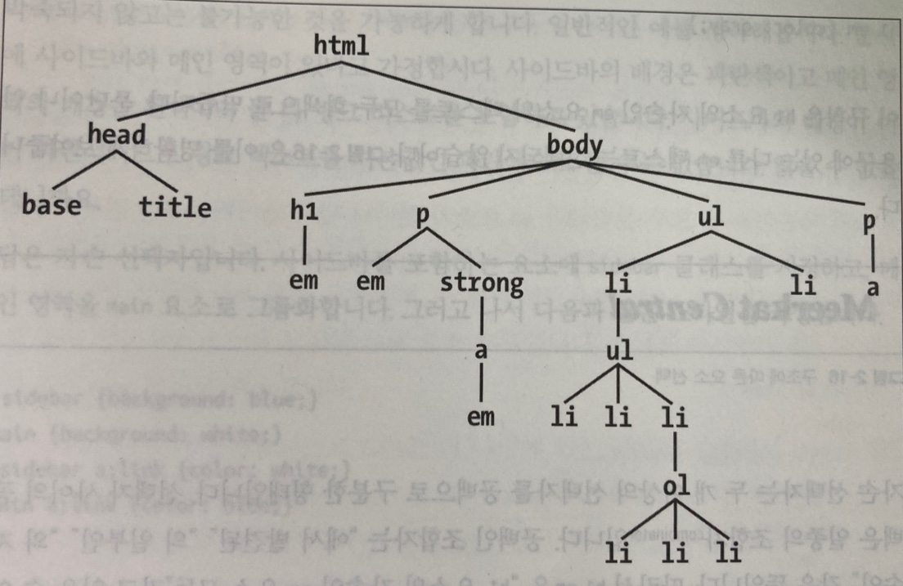
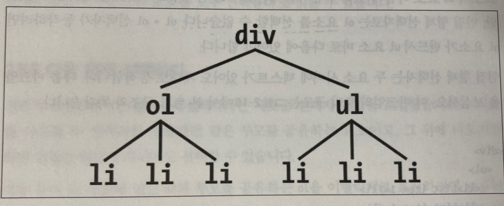

<p>

#### [back](../../../README.md) &nbsp;&nbsp; | &nbsp;&nbsp; write by [Santos](https://github.com/SangchoKim)

</p>

# 2-5. 문서 구조

<p align="center" >
    
</p>


---
<p> * 이 글은 CSS 완벽가이드 책을 참고하여 기록하였습니다. </p>

> CSS가 강력한 이유는 문서 구조에 따라 적절한 스타일을 결정하고, 적용하기 때문.

## 1. 부모-자식 관계

> 문서의 쓰인 요소들은 트리라는 계층 구조로 변환.

```
< 부모-자식 관계 예시 > 

<html>
    <head>
        <base href="http://www.meerkat.web">
        <title>Meerkat Central</title>
    </head>
    <body>
        <h1>Meerkat <em>Central</em></h1>
        <p>Welcome to meerkat <em>Central</em>, the 
            <strong>best meerkat web site on
                <a href="inet.html">the<em>entire</em> Internet</a>
            </strong>
        </p>
        <ul>
            <li>We offer: 
                <ul>
                    <strong>Detailed information</strong> on how to adopt a merrkat</li>
                    <li>Tips for living with a meerkat</li>
                    <li><em>Fun</em> things to do with a meerkat, including:
                        <ol>
                            <li>Playing fetch</li>
                            <li>Digging for fooe</li>
                            <li>Hide and seek</li>
                        </ol>
                    </li>
                </ul>
            <li>
            <li>...and so much more!</li>
        </ul>
        <p>
            Questions? <a href="mailto:suricate@meerkat.web">Contact us!</a>
        </p>
    </body>
</html>
```

<p align="center" >
    
</p>

#### \* 예시 설명 \*

 \- HTML 문서는 요소의 계층 구조를 기반으로 하며, 이 계층 구조는 위의 그림과 같이 트리 구조를 형성함.

 \- 문서의 요소는 모두 다른 요소의 부모 또는 자식이며, 대개는 부모인 동시에 자식임.

 \- 다른 요소의 바로 위에 있는 요소를 부모라고 하며, 반대로 다른 요소의 바로 아래 있는 요소를 자식이라고 함.

 \- 부모의 한 단계 위는 조상, 자식의 한 단계 아래는 자손으로 분류. 

 \- 트리 구조에서 두 요소가 한 단계 아래에 있다면 부모-자식 관계인 동시에 조상-자손 관계임. 

 \- 트리 구조에서 두 요소가 두 단계 아래에 있다면 부모-자식 관계는 아니고, 조상-자손 관계임.

 \- 즉, 자식은 동시에 자손이고, 부모는 동시에 조상임.

 \- html 요소는 문서 전체의 조상. 그러므로 루트 요소로라고 불림.

</br>

## 2. 자손 선택자

> 자식의 한 단계 아래. 

```
< 자손 선택자 예시 >

<html>
    <head>
        <base href="http://www.meerkat.web">
        <title>Meerkat Central</title>
    </head>
    <body>
        <h1>Meerkat <em>Central</em></h1>
        <p>Welcome to meerkat <em>Central</em>, the 
            <strong>best meerkat web site on
                <a href="inet.html">the<em>entire</em> Internet</a>
            </strong>
        </p>
        <ul>
            <li>We offer: 
                <ul>
                    <strong>Detailed information</strong> on how to adopt a merrkat</li>
                    <li>Tips for living with a meerkat</li>
                    <li><em>Fun</em> things to do with a meerkat, including:
                        <ol>
                            <li>Playing fetch</li>
                            <li>Digging for fooe</li>
                            <li>Hide and seek</li>
                        </ol>
                    </li>
                </ul>
            <li>
            <li>...and so much more!</li>
        </ul>
        <p>
            Questions? <a href="mailto:suricate@meerkat.web">Contact us!</a>
        </p>
    </body>
</html>

1) 일반 자손 선택자
h1 em {color: gray;}

2) 구체적인 자손 선택자
ul ol ul em {color: gray;}

```

#### \* 예시 설명 \*

 ##### 1) 일반 자손 선택자

 \- 자손 선택자는 두 개 이상의 선택자를 공백으로 구분한 형태. 선택자는 " "(공백)

 \- h1 em은 "h1 요소의 자손인 em 요소 모두"라고 해석이 가능함.

##### 2) 구체적인 자손 선택자

 \- ul의 자손인 ol, ol의 자손인 ul, ul의 자손인 em을 선택, 매우 구체적으로도 선택 가능.

</br>

## 3. 자식 선택자

> 요소의 바로 아래 있는 요소를 자식이라고 함.

```
< 예시 >

<h1>This is <strong>very</strong> important.</h1>
<h1>This is <em>really <strong>very</strong></em> important.</h1>

1) 일반 자식 선택자
h1 > strong {color: red;}

```

#### \* 예시 설명 \*

 ##### 1) 일반 자식 선택자

 \- 자손 선택자는 강력하지만 몇 단계든 속해 있기만 하면 전부 선택한다는 단점이 존재. 

 \- 자식 선택자는 오로지 해당하는 아래 요소만을 선택. 선택자는 ">"

 \- h1에 들어있는 strong 요소만 빨간색으로 표시.

</br>

## 4. 인접한 형제 요소 선택자

> 같은 부모 요소를 공유하는 형제 요소들.


<p align="center" >
    
</p>

```
< 예시 >

<div>
    <ol>
        <li>List item1</li>
        <li>List item2</li>
        <li>List item3</li>
    </ol>
    This is some text that is part of the 'div'
    <ul>
        <li>a List item</li>
        <li>Another list itme</li>
        <li>Yet another list item</li>
    </ul>
</div>

1) 일반 인접한 형제 요소 선택자
li + li {font-weight: bold;}

```


#### \* 예시 설명 \*

 ##### 1) 일반 인접한 형제 요소 선택자

 \- 같은 부모 요소를 공유하는 형제 요소를 선택할 때는 "+" 기호를 사용하여 선택.

 \- 위에 요소를 트리 형태로 나열 했을 때 리스트(ol, ul)은 div에 자식이면서, 리스트(ol, ul)은 인접한 형제임. 

 \- 각 리스트에 포함된 리스트 아이템 역시 인접한 형제, 하지만 각 리스트에 포함된 리스트 아이템 모두는 형제가 아님.

 \- 인접 형제 선택자는 두 형제 중 두번 째 요소만 선택됨. li + li 규칙은 각 리스트의 두 번쨰와 세 번째 아이템만 굵게 표시.

</br>

## 5. 다음 형제 선택자

> 같은 부모를 공유하면서 인접한 형제가 아닌 뒤에 나오는 모든 형제를 선택.


<p align="center" >
    
</p>

```
< 예시 >

<div>
    <h2>Subheadings</h2>
    <p>It is the case that not every heading can be a main heading. Some headings must be subheadings. Examples include:</p>
    <ol>
        <li>Headings that are less importants.</li>
        <li>Headings that are subsidiary to more important headlines.</li>
        <li>Headings that are like to be dominaged.</li>
    </ol>
    <p>Let's restate that for the record:</p>
    <ol>
        <li>Headings that are less importatns</li>
        <li>Headings that are subsidiary to more important headlines.</li>
        <li>Headings that are like to be dominaged.</li>
    </ol>
</div>

1) 일반 다음 형제 선택자
h2 ~ oi {font-style: italic;}

```


#### \* 예시 설명 \*

 ##### 1) 일반 다음 형제 선택자

 \- 은 부모를 공유하면서 인접한 형제가 아닌 뒤에 나오는 모든 형제를 선택할 때는 "~" 기호를 사용하여 선택.

 \- h2 ~ ol 선택자를 통해 h2와 부모를 공유하는 ol을 모두 이탤릭체로 표시. 

 \- 두 요소가 무조건 인접할 형제일 필요는 없음. 

</br>

 <span>읽어 주셔서 감사합니다.</span>

---

<strong><참고자료></strong>
</br>

[책] [#CSS완벽가이드][css완벽가이드] - 에릭마이어, 에스텔웨일 지음 -
</br>


<strong><선택자></strong> 문서구조 end

---

[css완벽가이드]: http://www.yes24.com/Product/Goods/98858290